# JETSCAPE Hydrodynamics Session

## Goals

- Understand how to run JETSCAPE with a few default Fluid dynamics modules
and set/change their relevant parameters, such as transport coefficients

- With a realistic hydrodynamic module, students will be able to output
hydrodynamic evolution profile and analyze the evolution of temperature
and the development of flow velocity with various settings

- Simulate event-by-event bulk dynamics for Au+Au @ 200 GeV and
Pb+Pb @ 5020 GeV with a realistic hydrodynamics code, such as MUSIC.

## Physics Background

The JETSCAPE framework employs the Trento model to generate event-by-event
initial energy density profile. The energy density profile is then passed to
the hydrodynamics module (MUSIC), which will evolve the collision system from
a hot QGP phase to the hadron gas phase. Optionally, pre-equilibrium dynamics
modeled by free-streaming can be included between the Trento and hydrodynamics.
In the dilute hadronic phase, fluid cells will convert to individual
hadrons. This process is denoted as the particlization. The JETSCAPE framework
uses iSS to perform particlization. The produced hadrons can be
fed to a hadronic transport model (SMASH), which accounts for scattering
processes among hadrons and decays of excited resonance states.

## Setup a docker container

If you plan to do exercises on a remote computer with `ssh`, please use the
following command to log in to your remote machine,

```
ssh -L 8888:127.0.0.1:8888 user@server
```

The port information is essential to properly setup jupyter notebook.

Before we begin our session, please make sure all the code packages are already
in the correct place on your computer. You should have a `jetscape-docker`
folder under your home directory. Try to list the folder inside
`jetscape-docker` with the following command,

```
ls ~/jetscape-docker
```

You need to make sure the following folders are present,

* JETSCAPE
* SummerSchool2021


In this session, we need to launch a docker container that supports the jupyter
notebook. Please use the following command:

**macOS:**
```
docker run -it --rm -p 8888:8888 -v ~/jetscape-docker:/home/jetscape-user --name myJSHydroSession jetscape/base:v1.4
```

**Linux:**
```
docker run -it --rm -p 8888:8888 -v ~/jetscape-docker:/home/jetscape-user --name myJSHydroSession --user $(id -u):$(id -g) jetscape/base:v1.4
```

- `--rm` This option will delete the current docker container at the exit.
(If you want to delete the container, you can add this option.)
- `-p 8888:8888` This option creates a port for your web browser outside
the docker container to load a jupyter notebook.
All the python packages are in the docker container.

Under Linux, if you encounter an error about `permission denied`,
you can use `sudo` in front of the docker run command.

## Build JETSCAPE with MUSIC and iSS

We will do all of our exercises in the **`JETSCAPE/build`** directory.
Please make sure all the external code packages (MUSIC and iSS) have been
downloaded. You can check this by the following commands,

```
cd ~/JETSCAPE/external_packages
ls
```

Please check the folder `music` and `iSS` are present.


If not, please run the following commands,

```
./get_music.sh
./get_iSS.sh
```


When you enter the docker container, type the following commands to setup
the working directory,

```
cd ~/JETSCAPE
mkdir -p build
cd build
cmake .. -DUSE_MUSIC=ON -DUSE_ISS=ON
make -j4
cp -r ../../SummerSchool2021/Jul21_Hydro/hydro_session .
```

The last command copies the hands-on materials of this session to the working folder.

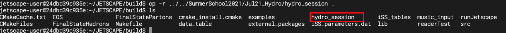


##  1. A Test Run for JETSCAPE with MUSIC

To perform a test run for JETSCAPE with MUSIC in our working directory
(**`~/JETSCAPE/build`**),

```
cd ~/JETSCAPE/build
./runJetscape hydro_session/jetscape_user_MUSICTestRun.xml
```
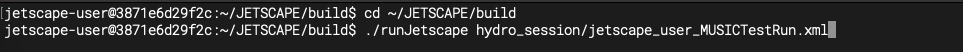

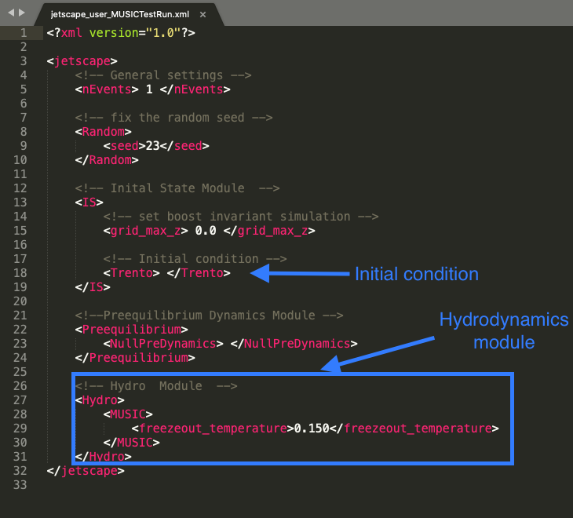

### Visualization with Jupyter Notebook

Launch jupyter notebook inside the docker contain with the following command
in our working directory (**`~/JETSCAPE/build`**),

```
cd ~/JETSCAPE/build
jupyter notebook --ip 0.0.0.0 --no-browser > notebook.log 2>&1 &
cat notebook.log
```

Once the jupyter notebook is running in the background, the user can click
on the link by holding the `ctrl` key. The link is displayed at the
second to the last line and begins with
`http://127.0.0.1:8888/?token=...`
After the click, your web browser should be launched in the current directory.
If your terminal does not recognize html addresses,
you can open your browser and enter the following address,
`http://127.0.0.1:8888/?token=...`

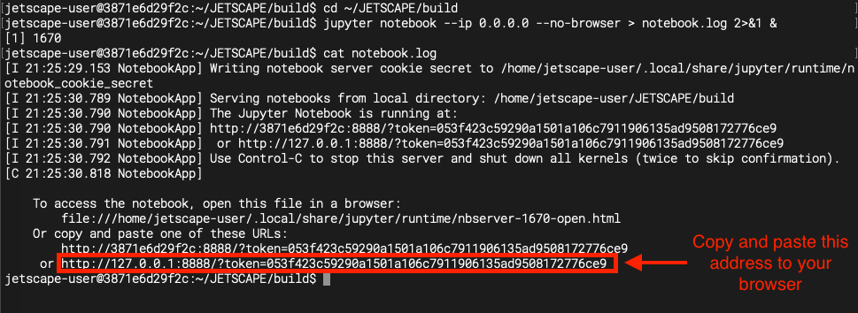

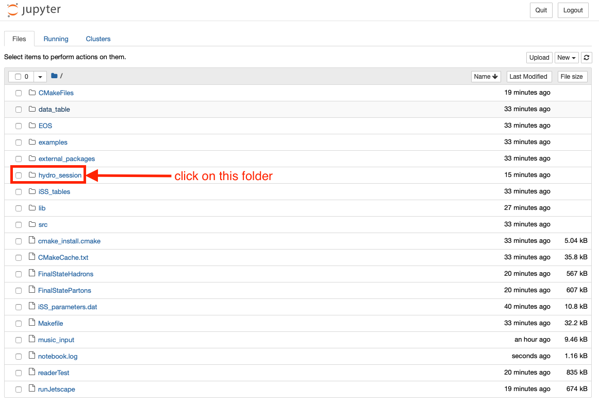

#### 1. Plot averaged temperature and flow velocity evolution

In your browser, we first go into the `hydro_session` folder
*(in your browser)*. We can open the notebook `hydro_evo_TestRun.ipynb`
by click on it inside the browser.
Once the notebook is opened, the user can execute every cell
in this notebook one-by-one. Press **`shift+enter`** to execute the cell block
in the notebook.

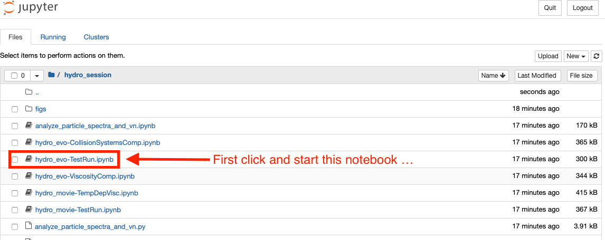

#### 2. Animation of averaged temperature and flow velocity evolution

Similar to the previous exercise, this time we will open the second notebook
under `hydro_session` folder, `hydro_movie_TestRun.ipynb`.
After it is opened inside your browser, you can execute
the code cells one by one to generate 2D color contour plots as well as
animation for the temperature and fluid velocity evolution.

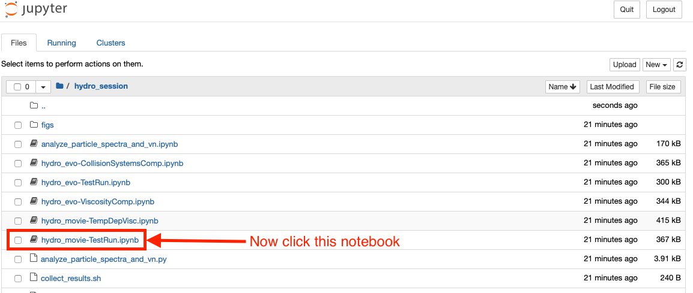

### No Jupyter Notebook?

If you can not use jupyter notebook, there are python scripts in the
`hydro_session` folder to generate the same plots and animation. Users can
run these scripts as follows,

```
cd ~/JETSCAPE/build/hydro_session
python3 hydro_evo-TestRun.py
python3 hydro_movie-TestRun.py
```
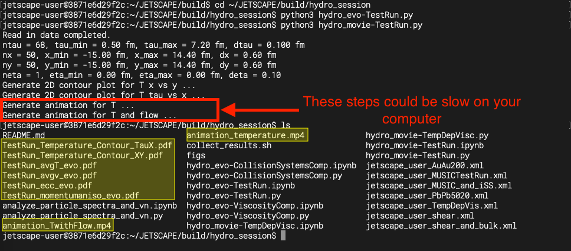

##  2. Change the collision systems

The users can specify the types of collision systems in JETSCAPE xml file,

* Collision Energy
* Colliding Nuclei
* Centrality

In the user configuration file `hydro_session/jetscape_user_AuAu200.xml`,
one can modify model parameters for the initial state module to simulate
his/her desired collision system. In between **`<Trento>`** and **`<\Trento>`**,
we can specify the type of colliding nucleus, collision energy, and centrality.

**[Run 1]** Simulate a 0-10% Au+Au collision at 200 GeV 
in our working directory (**`~/JETSCAPE/build`**),

```
cd ~/JETSCAPE/build
./runJetscape hydro_session/jetscape_user_AuAu200.xml; bash ./hydro_session/collect_results.sh Run_AuAu200_C0-10
```

The last command collects all the results into a new folder,
`Run_AuAu200_C0-10`.

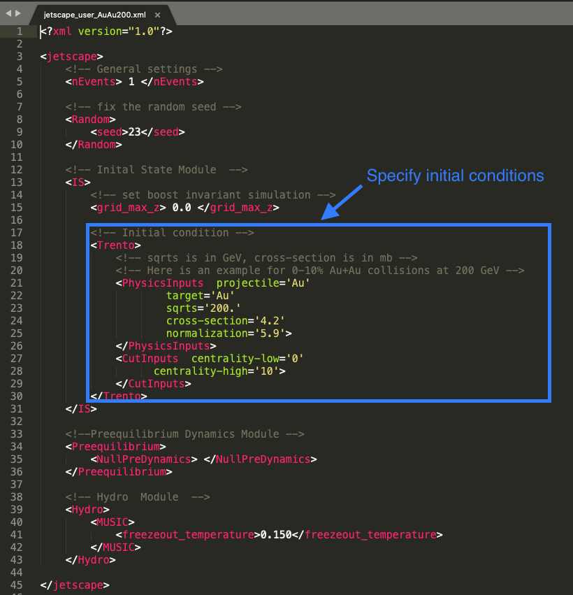

Here the nucleon-nucleon cross section is specified in the unit (fm^2)
(1[fm^2]= 10[mb])

**[Run 2]** Simulate a 20-30% Pb+Pb collisions at 5.02 TeV
in our working directory (**`~/JETSCAPE/build`**),

```
cd ~/JETSCAPE/build
./runJetscape hydro_session/jetscape_user_PbPb5020.xml; bash ./hydro_session/collect_results.sh Run_PbPb5020_C20-30
```

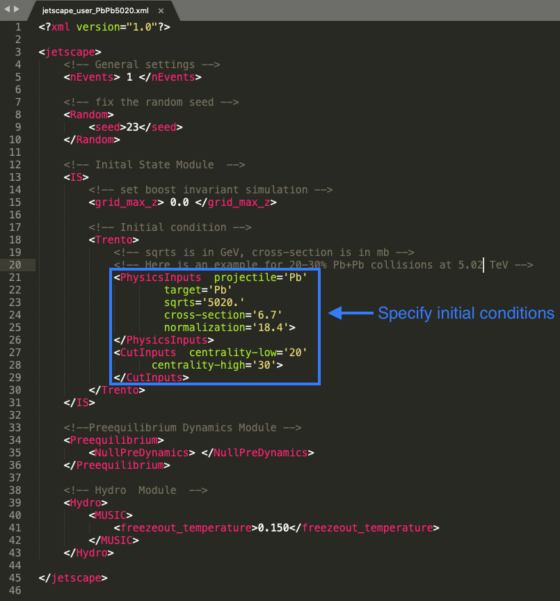

Now we can compare the evolution temperature and flow velocity between these
two systems. You can visualize the comparison using the jupyter notebook,
`hydro_evo-CollisionSystemsComp.ipynb`. Launch this notebook in your browser
and run the code cells one-by-one to see the comparisons
(same procedure as in the previous exercise). Alternatively, you can directly
run `hydro_evo-CollisionSystemsComp.py` to generate the same plots.

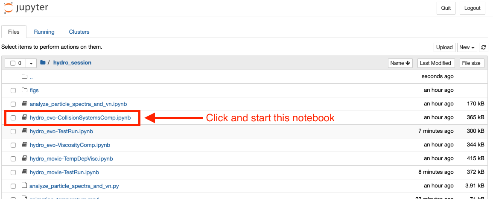

The results plots can be found in the `hydro_session` folder,

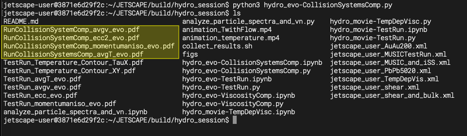

##  3. Study the effects of viscosity in hydrodynamic evolution

* Specific shear viscosity 
* Specific bulk viscosity 

Using a realistic hydrodynamic module inside the JETSCAPE, the users have
freedom to change a few physical parameters for the hydrodynamic simulations.
The most interesting ones are the specific shear and bulk viscosity.
All the relevant parameters are under the block `<hydro>` **`<MUSIC>`**.

The user can set a constant specific shear viscosity by changing the
value for the parameter **`<shear_viscosity_eta_over_s>`**. A physical $\eta/s$
needs to be a positive value. We recommend the users to try any real value
between **0** and **0.3** in the exercises.

Moreover, the users can include a non-zero bulk viscosity in the hydrodynamic
simulations. Because the QCD bulk viscosity is related to the breaking of
conformal symmetry, we expect the specific bulk viscosity to depend on
temperature, (T)).

Users can set the parameter `<temperature_dependent_bulk_viscosity>` to **1**,
in the xml file to include a temperature dependent
(T)).
Setting `<temperature_dependent_bulk_viscosity>` to **0** will set
.

Users can run the JETSCAPE with two example config files,

```
cd ~/JETSCAPE/build
./runJetscape hydro_session/jetscape_user_shear.xml; bash ./hydro_session/collect_results.sh Run_shear_only
./runJetscape hydro_session/jetscape_user_shear_and_bulk.xml; bash ./hydro_session/collect_results.sh Run_shear_and_bulk
```


Comparison plots can be made using the jupyter notebook
`hydro_evo-ViscosityComp.ipynb` or `hydro_evo-ViscosityComp.py`.

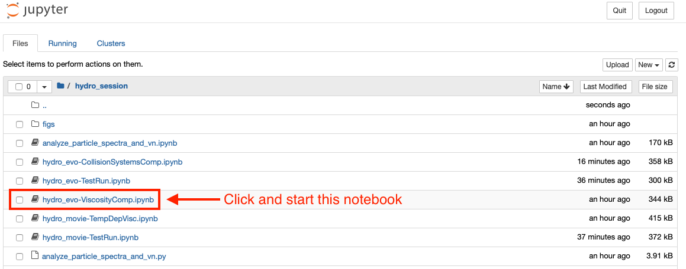

The resulting plots can be found under the `hydro_session` folder.

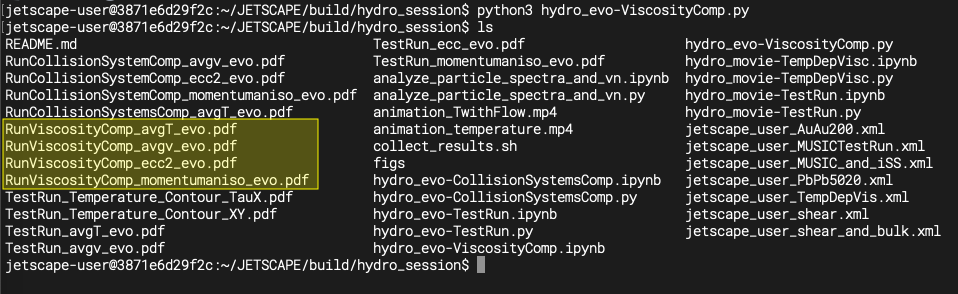 

##  4. Temperature dependent $(\eta/s)(T)$ and $(\zeta/s)(T)$

One can further try a temperature-dependent $(\eta/s)(T)$ by setting
the variable `<T_dependent_Shear_to_S_ratio>` to **3**. Once this parameter
is set to 3, the previous parameter `<shear_viscosity_eta_over_s>` will be
ineffective. The users need to further specify the following four parameters,

    1. <eta_over_s_T_kink_in_GeV>
    2. <eta_over_s_low_T_slope_in_GeV>
    3. <eta_over_s_high_T_slope_in_GeV>
    4. <eta_over_s_at_kink>`

to characterize the temperature dependence of
(T)).

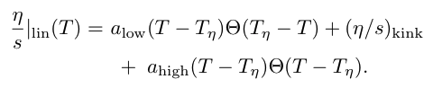 


Siimilar to the case for $(\eta/s)(T)$, the uses can set the parameter
`<temperature_dependent_bulk_viscosity>` to **3** in the xml file to include
a temperature dependent $(\zeta/s)(T)$.
With `<temperature_dependent_bulk_viscosity>` set to 3, the users needs to
further provide four additional parameters to characterize the shape of
(T)).
They are as follows,

    1. <zeta_over_s_max>
    2. <zeta_over_s_T_peak_in_GeV>
    3. <zeta_over_s_width_in_GeV>
    4. <zeta_over_s_lambda_asymm>

The parameterization is

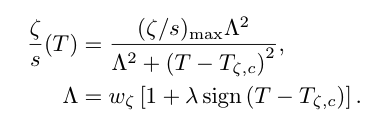 

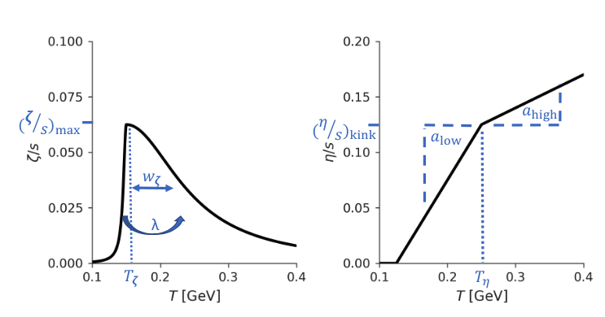 

Users can play with settings in `hydro_session/jetscape_user_TempDepVis.xml`.

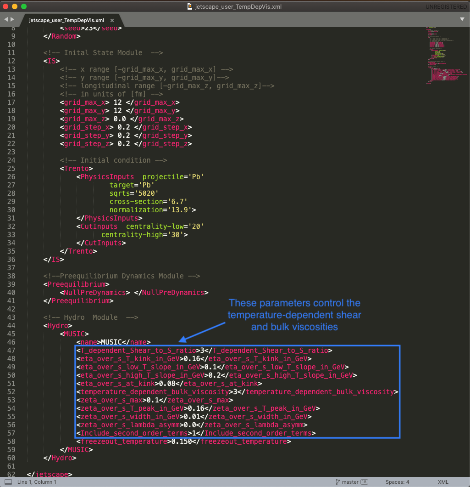 

```
cd ~/JETSCAPE/build
./runJetscape hydro_session/jetscape_user_TempDepVis.xml; bash ./hydro_session/collect_results.sh Run_TempDepVisc
```


The associated ploting scripts are `hydro_movie-TempDepVisc.ipynb` and
`hydro_movie-TempDepVisc.py`.

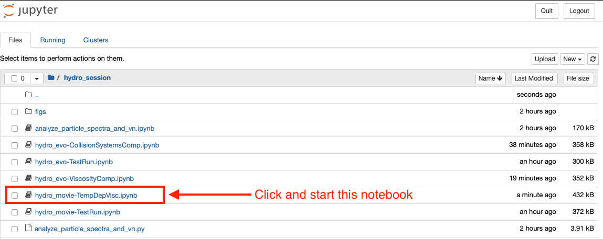 

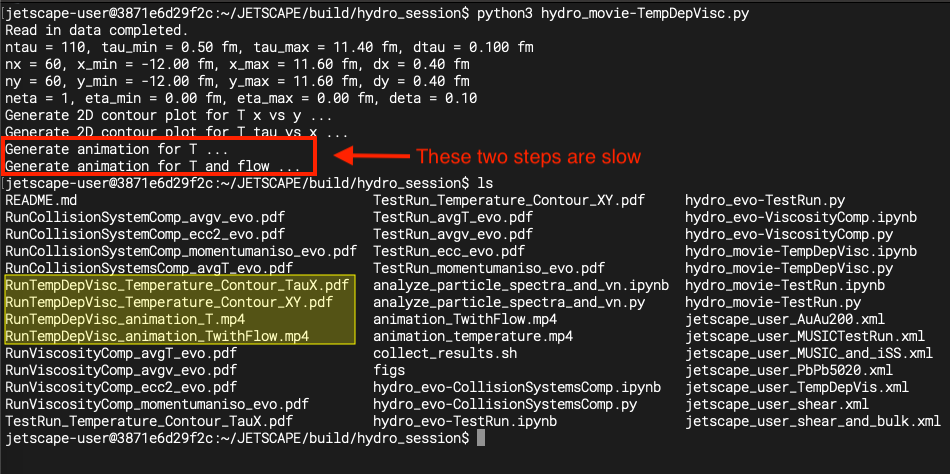 


## Side notes

In addition to specific shear and bulk viscosity, the users have freedom to
change the starting time of hydrodynamics, `<Initial_time_tau_0>` (0.2-1.0 fm)
, whether to include second order transport coefficients,
`<Include_second_order_terms>` (0 or 1), and particlization temperature,
`<freezeout_temperature>` (0.13 to 0.16 GeV)

Initial state module, between `<IS>` and `</IS>`, also define the 3D grid
that we would like to simulate hydrodynamic evolution. If one set
`grid_max_z` to 0, the JETSCAPE framework will perform a (2+1) hydrodynamic
simulations assuming longitudinal boost-invariant.

Cheet sheet for normalization factors in `Trento`,

| Collision sytem  | Collision energy (GeV)  |  norm factor | cross section (mb) |
|:---:|:---:|:---:|:---:|
| Au+Au  | 200   | 5.7  | 42 |
| Pb+Pb  | 2760  | 13.9 | 62 |
| Pb+Pb  | 5020  | 18.4 | 67 |

Available nucleus type in `Trento`: p, d, Cu, Xe, Au, Pb, U

Finally, the user can specify a random seed for the entire simulation.
This is specified inside the block `<Random>` in the xml file. If the
`<seed>` parameter is set to 0. Then the random seed will be determined by
the system time. If `<seed>` is set to any positive number, the JETSCAPE
will perform simulations with the given positive number is the random
seed for all its modules. A fix seed simulation will be handy when we
study the effect of viscosity during the hydrodynamic evolution.

After each run, please create a result folder with the viscosity information
and move the following three files into the result folder,

* `eccentricities_evo_eta_-0.5_0.5.dat`

This file records the evolution of spacial eccentricity of the fireball.
Format: `# tau(fm)  ecc_n(cos)  ecc_n(sin) (n=1-6)`

* `momentum_anisotropy_eta_-0.5_0.5.dat`

This file has the evolution information about the momentum anisotropy,
average velocity, and average temperature.
Format: `# tau(fm)  epsilon_p(ideal) epsilon_p(shear) epsilon_p(full) ecc_2  ecc_3  R_Pi  gamma  T[GeV]`

* `evolution_for_movie_xyeta_MUSIC.dat`

This file contains the evolution history of fluid cells above T = 130 MeV.
Every fluid cell includes the following information:
`itau  ix  iy  ieta  volume[fm^4]  e[GeV/fm^3]  rho_B[1/fm^3]  T[GeV]  mu_B[GeV]  u^x  u^y \tau*u^\eta  T^{\tau t}[GeV/fm^3]  J^\tau[1/fm^3]` 

## [Bonus] 5. Produce hadrons from hydrodynamics

In JETSCAPE, a third-party particle sampler iSpectraSampler (iSS) is employed
to convert fluid cells to particles. The iSS produces Monte-Carlo particles
from the hydrodynamic hyper-surface. The spatial and momentum distributions
of particles follow the Cooper-Frye Formula.

The sampled hadrons are output in the `test_out.dat`. One can run another
code script `FinalStateHadrons` to extract the final state hadron list from
the `test_out.dat` file. The users need to type in the following command at
the build folder,

```
cd ~/JETSCAPE/build
./runJetscape hydro_session/jetscape_user_MUSIC_and_iSS.xml
./FinalStateHadrons test_out.dat hadron_list.dat
```
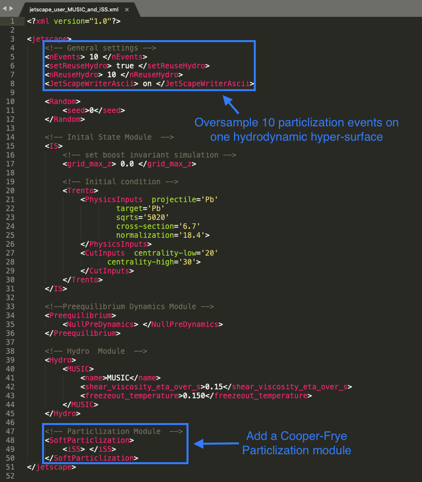 

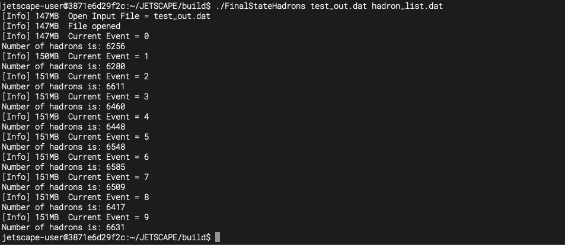 

With the produced `hadron_list.dat` file, the users can apply their own
analysis script to compute particle spectra, mean
, and
anisotropic flow coefficients
.
Example analysis codes are `analyze_particle_spectra_and_vn.ipynb` and `analyze_particle_spectra_and_vn.py`.

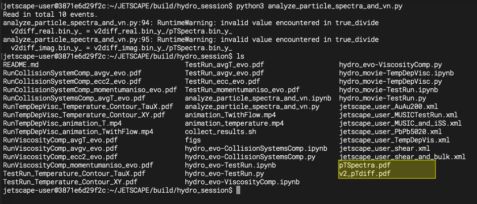 

# HOMEWORK

## 1. Study the viscous effects on hydrodynamic evolution

Simulate a Pb+Pb collision in 20-30% centrality at 5.02 TeV. In order to
compare simulations with different viscosity, we need to fix the
random seed. You can choose your favorite number for the seed. (42?)

* Compare the development of flow anisotropy as a function of proper time
with two different shear viscosities

* Compare the development of averaged radial with and without the specific
bulk viscosity

* Compare the averaged temperature evolution with two choices of
the specific bulk viscosity
(T))


## 2. Produce animation for the temperature and flow velocity profiles in the transverse plane

* Pick your favorite collision system (colliding nuclei, collision energy,
and centrality) and generate a hydrodynamic evolution file.

You can try different color maps or even define your own to make the
animation vivid.

Please send your best animation to chunshen@wayne.edu.
We will select the most impressive ones and post them on the school website.


## 3. [Bonus] Compute particle spectra and flow anisotropic flow Qn vectors from the event-by-event simulations for one heavy-ion collision system.

To accumulate statistic, you can set `<nEvents>` to 50 and
`<nReuseHydro>` to 50 in the xml file to avoid running 50 hydrodynamic
simulations. With the generated `test_out.dat` file, apply `FinalStateHadron`
and analysis the output to get
-spectra
for charged hadrons and their flow anisotropy coefficients.
