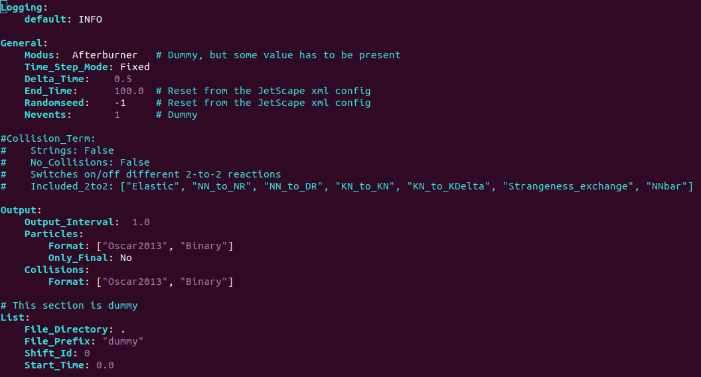

# SMASH hadronic transport hands-on session

### Our goals
 - Learn to use SMASH as a hadronic afterburner
 - Understand SMASH inputs: resonances and their decays, switching on and off different reactions
 - Understand SMASH outputs: particles and collision history
 - Physics project: Life and death of rho-resonance

**To begin** add your name to the [table](https://docs.google.com/spreadsheets/d/1Q02JeQKvoLgwWFNQ0jBwi3qsyiSrnGOGvQmQRaUTfas/edit?usp=sharing) to mark your progress.
Then follow the steps below.

It would be great if you **perform step 1. in advance**,
because compilation of SMASH library takes around 5 minutes, compilation
of JetScape with SMASH takes around 7 minutes, running and getting 10 events takes
around 7 minutes = around 20 minutes total.

<details><summary> In case copy-paste with mouse doesn't work in docker environment </summary>
<p>
I had this annoying problem that mouse selection, copying, and pasting do not work properly in
the docker terminal. Here is how I solved it:

```bash
  echo "xterm*selectToClipboard: true" > ~/.Xdefaults
```

</p>
</details>

<details><summary> My personal docker cheat sheet </summary>
<p>

I'm not an active docker user, so here I assemble commands that were useful for me:

```bash
  docker container ls -a        # List all containers
  docker system prune           # Remove all the stopped containers
  docker start -ai myJetscape   # Start JETSCAPE docker again after exiting

  # run JETSCAPE container on linux
  docker run -it -v ~/jetscape-docker:/home/jetscape-user --name myJetscape --user $(id -u):$(id -g) jetscape/base:v1.4

  # run JETSCAPE container on MAC
  docker run -it -v ~/jetscape-docker:/home/jetscape-user --name myJetscape jetscape/base:v1.4
```

</p>
</details>


<details><summary><b> What is SMASH </b></summary>
<p>

SMASH is a hadronic transport code. In JETSCAPE it simulates multiple hadron-hadron scatterings
in the final dilute stage of the fireball evolution. Observables affected by the afterburner
are baryon spectra and flow, as well as resonance production.

Look at the visualization at the [official SMASH webpage](https://smash-transport.github.io/).

</p>
</details>


<details><summary><b> Making sure prequisites are ready </b></summary>
<p>

I assume that you have followed the [general school instructions](https://github.com/JETSCAPE/SummerSchool2021/blob/master/README.md)
 and have docker installed. You really need docker to proceed.

Before we begin our session, please make sure all the code packages are already
in the correct place on your computer. You should have a `jetscape-docker`
folder under your home directory. Try to list the folder inside
`jetscape-docker` with the following command,

```bash
ls ~/jetscape-docker
```

You need to make sure the following folders are present,

* JETSCAPE
* SummerSchool2021

Update your Summer School folder

```bash
cd SummerSchool2021
git pull origin master
cd -
```

Try the following command to make sure you are ready

```bash
    docker start -ai myJetscape
```
</p>
</details>

<details><summary><b> 1. Compiling JetScape with SMASH in docker environment </b></summary>
<p>

Go to the docker environment. If you didn't start it yet, start by

```bash
  docker start -ai myJetscape
```

Compiling JetScape with MUSIC + iSS + SMASH:

```bash
cd jetscape-docker/JETSCAPE/external_packages

# Download MUSIC hydrodynamics, iSS particle sampler, EoS tables
./get_music.sh
./get_iSS.sh
./get_freestream-milne.sh
./get_lbtTab.sh

# Downloading SMASH and compiling SMASH as library
# This takes around 5 minutes on laptop
./get_smash.sh

cd jetscape-docker/JETSCAPE/build
cmake .. -DUSE_MUSIC=ON -DUSE_ISS=ON -DUSE_SMASH=ON

# Compiles JetScape+MUSIC+SMASH
# This takes around 7 minutes on laptop
# The number after j means number of cores, adjust according to available computing power
make -j2
```

Let us run JETSCAPE with SMASH

```bash
cd ~/jetscape-docker/JETSCAPE/build

# Creating output directory with this specific name is important, otherwise you get a crash
mkdir smash_output

# The argument is a JetScape configuration file
./runJetscape ../../SummerSchool2021/Jul22_Transport/jetscape_user_AuAu200.xml
```

While the code is running we explore the way SMASH is configured.

</p>
</details>


<details><summary><b> 2. Configuring SMASH </b></summary>
<p>

 Let us have a look at the JetScape configuration file `SummerSchool2021/Jul22_Transport/jetscape_user_AuAu200.xml`:
 


 From the JetScape configuration one can only set the end time of the simulation
 and switch off all collisions. Detailed SMASH configuration is in the
 SMASH config files. They are described in detail in [SMASH user guide](http://theory.gsi.de/~smash/userguide/1.8/).
 In this tutorial we look at some of the options.

 Let's look at the SMASH config file `SummerSchool2021/Jul22_Transport/smash_config.yaml`:
 


 Focusing on the Output section:

  ```yaml
    Output:
        Output_Interval: 1.0
        Particles:
            Format:          ["Oscar2013"]
  ```

  This means that SMASH is going to print out all the particles in
  Oscar2013 format (a simple human readable text), and if it is required to
  print out particles in the middle of the simulation, it will do so every 1.0 fm/c.
  By default SMASH will print out only particles in the end of the simulation.
  To make it actually print out particles every 1 fm/c we need to supply our config with
  an additional `Only_Final: No` option.

  ```yaml
    Output:
        Output_Interval: 1.0
        Particles:
            Format:          ["Oscar2013"]
            Only_Final:      No
  ```

**Check out particles and decaymodes files**
----

In the `SummerSchool2021/Jul22_Transport` folder look at `particles.txt` and `decaymodes.txt`.
The file `particles.txt` is the list of all hadrons used in the simulations:
 

The file `decaymodes.txt` is the list of resonance decaymodes.
 

Both files can be edited without recompiling the code. This
is a useful opportunity when you, for example, study resonance production
and want to vary branching ratios into of decays into this resonance, or
of decays of the resonance.


**Let's look at the results of our simulations**
----

  The SMASH output is in the `smash_output` folder.
  If you followed previous instructions and the luck is on your side then there are 4 files in the folder:
  ```
  particles_binary.bin
  collisions_binary.bin
  particle_lists.oscar
  full_event_history.oscar
  ```

  The files (`particles_binary.bin` and `particle_lists.oscar`) as well as
  (`collisions_binary.bin` and `full_event_history.oscar`) contain the same information, but
  in different formats. Oscar files are human-readable and bin files are binary. SMASH can also
  generate outputs in ROOT, vtk, hepmc formats.
  Let's look at the contents of particle_lists.oscar, you should see something like this:

  ```bash
   #!OSCAR2013 particle_lists t x y z mass p0 px py pz pdg ID charge
   # Units: fm fm fm fm GeV GeV GeV GeV GeV none none e
   # SMASH-1.8
   # event 1 out 470
   200 -106.204 58.1653 -14.4014 0.938 1.26645138 -0.746754441 0.397353787 -0.092319454 2112 2364 0
   200 104.02 39.1754 98.0998 0.938 1.4867404 0.782602686 0.334508298 0.778582208 2212 907 1
   200 15.7665 -21.8512 -137.847 0.938 1.34280422 0.101448745 -0.118439561 -0.948134694 2212 2344 1
   ...
  ```

  In principle you can analyse these results using your favourite way to write scripts.
  In the [2020 SMASH tutorial](https://github.com/JETSCAPE/SummerSchool2020/tree/master/SMASH_session)
  I suggested a quick and easy way to use ROOT output for analysis.
  In this tutorial, I would like to take advantage of the SMASH analysis suite, that reads in binary output.
  Original [SMASH analysis suite](https://github.com/smash-transport/smash-analysis) is in python2,
  so I had to update scripts to python3 and put them into the `SummerSchool2021/Jul22_Transport` folder
  to be compatible with docker environment.

</p>
</details>


<details><summary><b> 3. Life and death of rho-meson </b></summary>
<p>

Some questions to explore:
----

1. What reactions create and destroy ρ⁰ in SMASH? Which of these reactions are more important and which less?
2. Are the producing and destroying reactions in equilibrium or not?
3. How many of ρ⁰ resonances sampled from hydro end up in the detector?
4. When and where are the detectable ρ⁰ typically born? typically decay?
5. How many ρ⁰ get excited to higher mass resonances, which decay into something else?
6. How important is regeneration (π⁺π⁻ -> ρ⁰) for the detected ρ⁰ yield
7. How important are 2 ↔ 2 reactions compared to 1 ↔ 2 for ρ⁰ production?
8. Your own research question, please suggest them in the chat

Analyzing the output of SMASH
----

```bash
TRANSPORT_WORKSHOP_FOLDER="/home/jetscape-user/SummerSchool2021/Jul22_Transport/"
RESULTS_FOLDER="./results/"
mkdir -p $RESULTS_FOLDER

# Test that scripts read the binary fine
python $TRANSPORT_WORKSHOP_FOLDER/quick_read.py smash_output/collisions_binary.bin

# Run reaction counter
python ${TRANSPORT_WORKSHOP_FOLDER}/count_reactions.py --production ρ⁰ \
       ${RESULTS_FOLDER}/reaction_rates_output_midrapidity.txt \
       ${RESULTS_FOLDER}/production_output_midrapidity.txt \
       "π⁺,π⁻:ρ⁰|π⁺,ρ⁰:a₁(1260)⁺|π⁻,ρ⁰:a₁(1260)⁻|π⁰,ρ⁰:h₁(1170)|π⁰,ρ⁰:ω" \
       1.0  ${TRANSPORT_WORKSHOP_FOLDER}/dummy_config.yaml \
       ./smash_output/collisions_binary.bin

# Count multiplicity versus time
python ${TRANSPORT_WORKSHOP_FOLDER}/multiplicity_vs_time.py \
       ${RESULTS_FOLDER}/multiplicity_vs_time_midrapidity.txt \
       "π⁺,π⁻,p,ρ⁰" \
       ${TRANSPORT_WORKSHOP_FOLDER}/dummy_config.yaml \
       ./smash_output/particles_binary.bin

# Analyze collision graph: record destiny of resonances and find detectable one
cd $RESULTS_FOLDER
python ${TRANSPORT_WORKSHOP_FOLDER}/collision_graph_analysis.py \
       ../smash_output/collisions_binary.bin
```

These analyzed results are collected in one folder. Select one question
above and answer it using them. You might need to slightly modify the analysis scripts.
As an example of interesting physics information obtained from this analysis
let me show the "destiny" plot of rho0 resonances:

**Outside of docker environment** run this plotting script

```bash
cd ~/jetscape-docker/JETSCAPE/build
python3 ../../SummerSchool2021/Jul22_Transport/la_destiny_sankey.py ./results/destiny_matrix.txt
```

What are the conclusions from this plot?
What questions were you able/not able to answer? Why?

</p>
</details>
