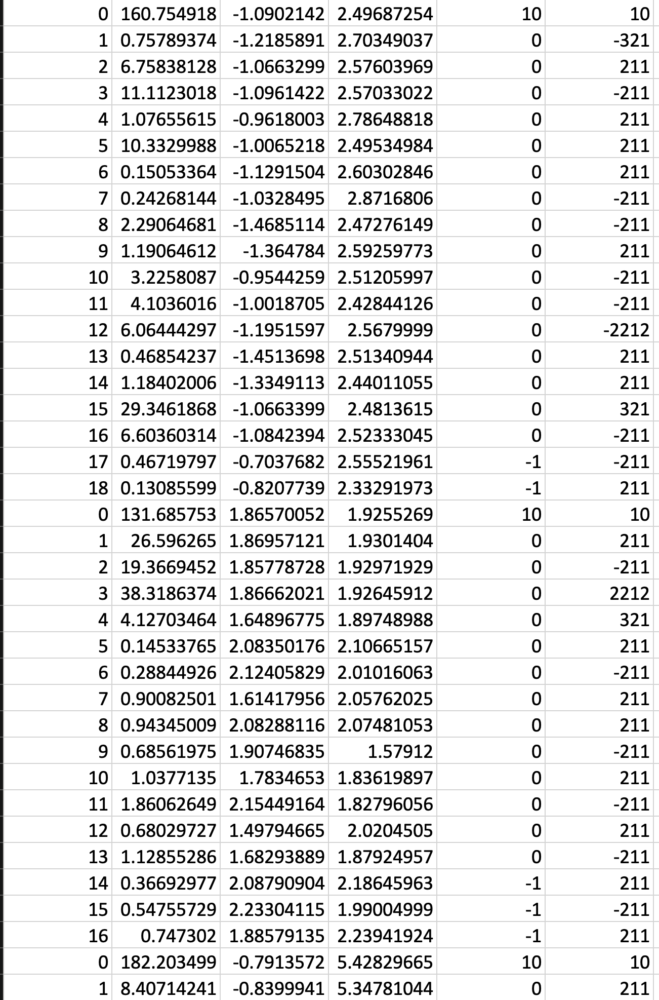
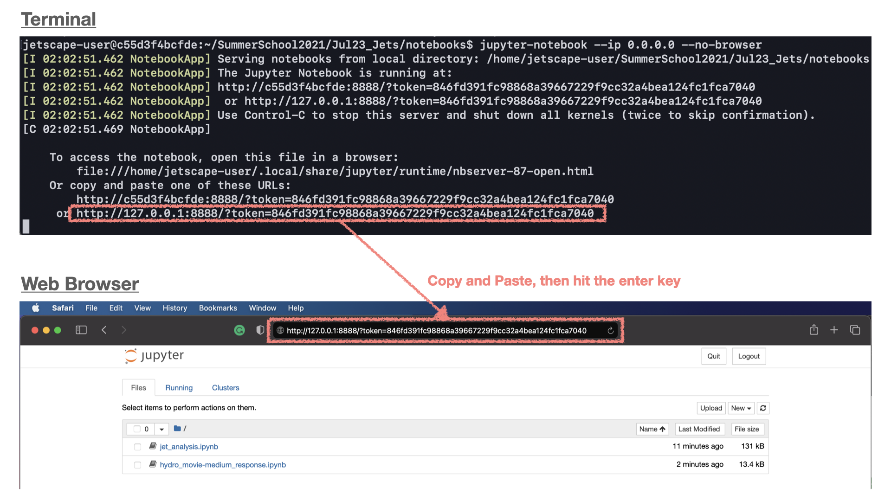
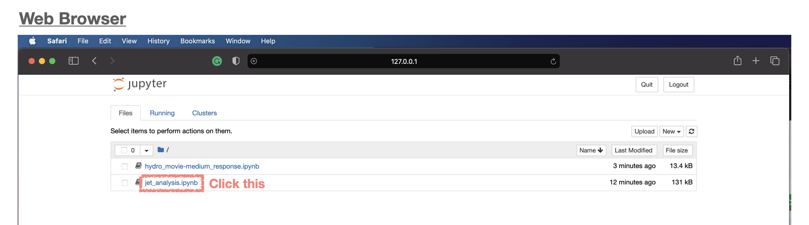
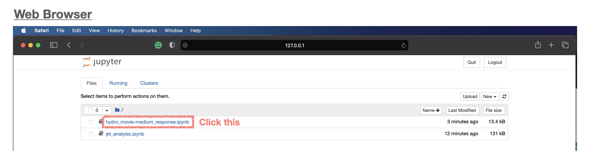

# <b>JETSCAPE Jet Session</b>

## <b>0. Preparation: Event Generation [Day 1]</b>
Here we generates hard scatterings with JETSCAPE for both pp and PbPb at 5.02 TeV.
On the second day, we will use the generated event data and do analysis for jet ovservables. 
In this example, for each of pp and PbPb, we are generating 250 hard scatterings with 100<$\hat{p}_T$<160 GeV. 

### <span style="color: orange; ">0.1. Start the Docker Container<span>

If you use ssh to do exercises on a remote computer, you need to create your ssh session with the following command: 

```
ssh -L 8888:127.0.0.1:8888 user@server
```

Then, please start the docker container,

For MacOS
```
docker run -it -p 8888:8888 -v ~/jetscape-docker:/home/jetscape-user --name myJSJetSession jetscape/base:v1.4
```

For Linux
```
docker run -it -p 8888:8888 -v ~/jetscape-docker:/home/jetscape-user --name myJSJetSession --user $(id -u):$(id -g) jetscape/base:v1.4
```
If you get an error `permission denied` on Linux,
please try `sudo`.

The option `-p 8888:8888` is necessary to creates a port to access the jupyter notebook, which we use in this hands-on session, from your local web browser.


### <span style="color: orange; ">0.2. Get Materials<span>


Inside the docker container, download the school material from git if you have not:

```
cd ~/
git clone https://github.com/JETSCAPE/SummerSchool2021.git
```

If you have alread downloaded the material, please update to the latest version:
```
cd ~/SummerSchool2021
git pull
```
  
Please also update JETSCAPE to the latest version:
```
cd ~/JETSCAPE
git pull
```

Go to `SummerSchool2021/Jul23_Jets` directory and download hydro profile files for this session:

```
cd ~/SummerSchool2021/Jul23_Jets
source ./get_hydro_profile.sh
```

### <span style="color: orange; ">0.3. Build JETSCAPE with LBT-tables, MUSIC and iSS</span>

Please make sure all the external code packages (LBT-tables, MUSIC and iSS) have been
downloaded in `JETSCAPE/external_packages`. You can check this by the following commands,

```
cd ~/JETSCAPE/external_packages
ls
```

Please check the folder `LBT-tables`, `music` and `iSS` are present.
If not, please get them with the following commands,

```
./get_lbtTab.sh
./get_music.sh
./get_iSS.sh
```

Setup and build JETSCAPE from inside the docker container:

```
cd ~/JETSCAPE
mkdir build
cd build
cmake .. -DUSE_MUSIC=ON -DUSE_ISS=ON
make -j4
```

### <span style="color: orange; ">0.4. Test Run and Graph Visualization</span>

Inside `build`, execute `runJetscape` with `jetscape_user_PP_PHYS.xml` in `SummerSchool2021/Jul23_Jets/config`

```
./runJetscape ../../SummerSchool2021/Jul23_Jets/config/jetscape_user_PbPb_PHYS_TestRun.xml
```

Check whether the code finished running without any error.

Then, lets' Visualize the parton shower. First, run `readerTest` inside `build`
```
./readerTest
```

Next, go <b><u>outside the docker</u></b>, install Graphviz (if you do not have). 

If you use Anaconda, you can get Graphviz via the command, 
```
conda install graphviz  
```

For MacOS via Homebrew
```
brew install graphviz
```

For MacOS via MacPorts
```
sudo port install graphviz
```

For Ubuntu or Debian
```
sudo apt install graphviz
```

For Fedora, Redhat, or CentOS
```
sudo yum install graphviz
```

Then, go `~/jetscape-docker/JETSCAPE/build` <b><u>outside the docker</u></b> and convert `my_test.gv` to a pdf file 
```
dot my_test.gv -Tpdf -o outputPDF.pdf
```

Open `outputPDF.pdf` in `build` with your pdf viewer and find the parton shower history.

### <span style="color: orange; ">0.5. Run pp@5.02 TeV Events</span>

In `build` directory <b><u>inside the docker</u></b>, execute `runJetscape` with `jetscape_user_PP_PHYS.xml` in `SummerSchool2021/Jul23_Jets/config`

```
./runJetscape ../../SummerSchool2021/Jul23_Jets/config/jetscape_user_PP_PHYS.xml
```

The list of hadrons in the final states of events is stored in `test_out_pp_final_state_hadrons.dat`

### <span style="color: orange; ">0.6. Run PbPb@5.02 TeV Events (Homework)</span>
In `build` directory <b><u>inside the docker</u></b>, execute `runJetscape` with `jetscape_user_PbPb_PHYS.xml` in `SummerSchool2021/Jul23_Jets/config`

```
./runJetscape ../../SummerSchool2021/Jul23_Jets/config/jetscape_user_PbPb_PHYS.xml
```
This takes <b><u>more than 30 mins</u></b>. 
The list of hadrons in the final states of events is stored in `test_out_pbpb_final_state_hadrons.dat`

### <span style="color: orange; ">0.6. Run PbPb@5.02 TeV Events with different parameters (Homework, Optional)<span>

Copy `jetscape_user_PbPb_PHYS.xml` and edit it for simulations with other parameter sets. 
For example, you can set larger coupling $\alpha_{s}$ by editting `<alphas>` in `<Matter>` and `<Lbt>`, or you can perform simulations without low virtuality phase description by `<Lbt>` by erasing the whole tags of `<Lbt>`.

Here, not to overwrite the output file you have generated, please put different name in `<outputFilename>` in the xml, for example:

```
<outputFilename>test_out_pbpb_my_parameter_set</outputFilename>
```


## <b>1. Jet Analysis [Day 2]</b>

### <span style="color: orange; ">1.1. Relaunch the Docker for the session<span>

If you use ssh to do exercises on a remote computer, you need to create your ssh session with the following command: 

```
ssh -L 8888:127.0.0.1:8888 user@server
```

Then, please restart the docker container for this session:
```
docker start -ai myJSJetSession
```

If you have already deleted the docker image, please create it again:

For MacOS
```
docker run -it -p 8888:8888 -v ~/jetscape-docker:/home/jetscape-user --name myJSJetSession jetscape/base:v1.4
```

For Linux
```
docker run -it -p 8888:8888 -v ~/jetscape-docker:/home/jetscape-user --name myJSJetSession --user $(id -u):$(id -g) jetscape/base:v1.4
```
If you get an error `permission denied` on Linux,
please try `sudo`.

The option `-p 8888:8888` is necessary to creates a port to access the jupyter notebook, which we use in this hands-on session, from your local web browser.


Go to `SummerSchool2021/Jul23_Jets` directory and execute the script `init.sh` inside `SummerSchool2021/Jul23_Jets`:

```
cd ~/SummerSchool2021/Jul23_Jets
source ./init.sh
```

### <span style="color: orange; ">1.2. Jet Reconstruction</span>
Here using the final state hadron list from JETSCAPE as input, we reconstruct jet by anti-kt algorithm [https://arxiv.org/abs/0802.1189] with jet cone size, R=0.4 by FastJet [http://www.fastjet.fr]. In the output file from the analysis code, information of jets with $p_{\mathrm{T}}$ > 100 GeV and charged hadrons inside the jet cone (associated particles) will be stored. 

Please go to `SummerSchool2021/Jul23_Jets/analysis_scripts` directory and find `jet_reconstruction.py`.
```
cd analysis_scripts
```


Then first, run `jet_reconstruction.py` for pp events:
```
python jet_reconstruction.py -i ../../../JETSCAPE/build/test_out_pp_final_state_hadrons.dat -o ../data/jet_pp.dat
```

Option `-i` is used to specify the input file path (final state hadron list)
and option `-o` is for the output file path 


Then please run `jet_reconstruction.py` also for PbPb events:
```
python jet_reconstruction.py -i ../../../JETSCAPE/build/test_out_pbpb_final_state_hadrons.dat -o ../data/jet_pbpb.dat
```

Once finish running the analysis code, you will find `jet_pp.dat` and `jet_pbpb.dat` 
in `SummerSchool2021/Jul23_Jets/data`
storing the information of reconstructed jets.

Inside those files, for each jet, the information of charged hadrons detected inside the jet cone (delta r < R =0.4) is stored in csv format:



### <span style="color: orange; ">1.3. Analysis (with Jupyter Notebook)</span>

If you have already launched any jupyter notebooks outside the docker, please close them all first! Then, launch jupyter notebook in `SummerSchool2021/Jul23_Jets/notebooks` inside the docker contain with the following command,

```
cd ~/SummerSchool2021/Jul23_Jets/notebooks
jupyter-notebook --ip 0.0.0.0 --no-browser
```

Open the displayed address starting with `http://127.0.0.1:8888/?token=...` in your browser. 




Then please open `jet_analysis.ipynb`, and follow the instructions.



Once you have done, please close jupyter notebook to continue the later part of the workshop. 


### <span style="color: orange; ">1.4. Analysis of events generated with different parameter set (Optional 1)</span>

If you generated events with parameters different from the default one, 
please go through the processes above also for them. 
You can see the change of jet RAA and modification patterns of jet fragmentation and jet shape.

### <span style="color: orange; ">1.4. Analysis of jets reconstructed with different jet cone size (Optional 2)</span>

With the option `-r` you can empeloy the jet cone size different from the default one R=0.4 in `jet_reconstruction.py`. For example, if you run `jet_reconstruction.py` in the following way
```
python jet_reconstruction.py -r 0.6 -i ../../../JETSCAPE/build/test_out_pp_final_state_hadrons.dat -o ../data/jet_pp_r_0p6.dat
```
jets will be reconstructed with jet cone size R=0.6. 

Perform jet reconstruction by `jet_reconstruction.py` with jet cone size different from R=0.4 for both pp and PbPb, and then go through the analysis processes with Jupyter Notebook for them. 


## <b>2. Hydrodynamic Medium Response [Day 2]</b>
Here we see the pattern of hydrodynamic flow excited by the jet propagation in the medium by performing simulations of two-stage hydro with liquefier in JETSCAPE. 

### <span style="color: orange; ">2.1. Run Twostage Hydro of JETSCAPE</span>

Go to `~/JETSCAPE/build` and perform a simulation with hydrodynamic medium response: 

```
cd ~/JETSCAPE/build
./runJetscape ../../SummerSchool2021/Jul23_Jets/config/jetscape_user_twostagehydro_PHYS.xml 
```

### <span style="color: orange; ">2.2. Visualization with Jupyter Notebook</span>

Again, if you have already launched any jupyter notebooks outside the docker, please close them all first! Then, launch jupyter notebook in `SummerSchool2021/Jul23_Jets/notebooks` inside the docker contain with the following command,

```
cd ~/SummerSchool2021/Jul23_Jets/notebooks
jupyter-notebook --ip 0.0.0.0 --no-browser
```

Open the displayed address starting with `http://127.0.0.1:8888/?token=...` in your browser. 
Then please open `hydro_movie-medium_response.ipynb`, and follow the instructions.




